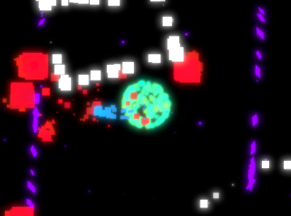

# A-Particle-Of-Me-Boneless
 A personal spin-off of Zyger's game made with only particles, but extra difficulty
 Created on 6/23/2020, 9 AM according to file metadata

 

 I said once to a friend
 > You know what, I'll even challenge myself to replicate it in two hours quite literally almost using only particle systems
 - *TheLegendary1248, 6/21/20, unknowing future him would come back even years later*

Which meant, just Unity's particle system, no built-in components(excluding Transform/GameObjects/URP/Camera), and Scripts
*i got stuck on getting URP to work, but i eventually got the actual game done in a short period of time that I don't remember*
---
### Gameplay
Similarly, the game plays out just about just like Zyger's game...

 You are a simple cluster of particles with the simple goal of defending the center by ramming into enemies
 Enemies spawn periodically, in increasing numbers, and fly towards the direction of the center
 The player is moved via click and drag, applying velocity, in the style similar to a slingshot
 Hitting the edge of the playing field inverts the player's velocity in that direction
 You lose after the center is hit thrice

...but with some extra features

Avoids usage of most of Unity's built-in components. This does mean collisions too are calculated via script
A few extra enemies
The camera rotates back and forth with increased speed with every change
Instead of a scoreboard, each kill adds a 'star' particle to the background
Similarly, lives are not shown but rather represented as particle density of the center

### Enemies
- **Square(`reg`/Normal Enemy)**
    A simple enemy that crumbles from a single hit 
- **Big Square(`heavy`/Heavy)**
    A slightly harder enemy that reduces the user's speed and takes knockback, dissolving after three hits
- **Circle(`explode`/Exploder)**
    An enemy that launches the player in the opposite direction
- **Triangle(`kill`/Killer)**
    An enemy that can't harm the center and will fly in an offset direction, but disables the player upon hit
- **Masker**
    A square that uses sprite masking to hide anything within it

**I might come back one day and make it a small hypercasual game**